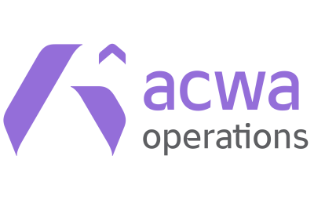
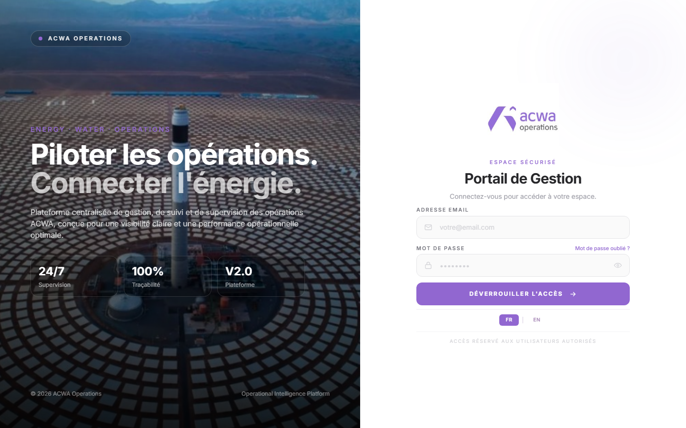
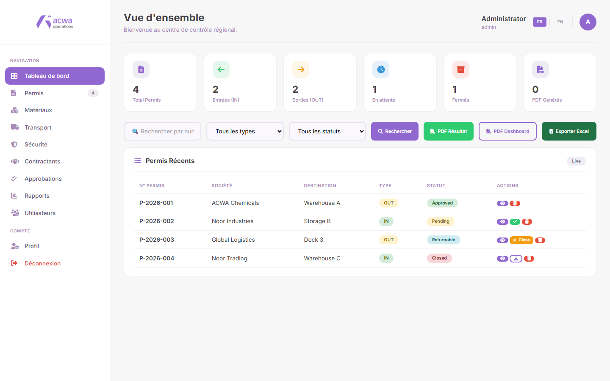
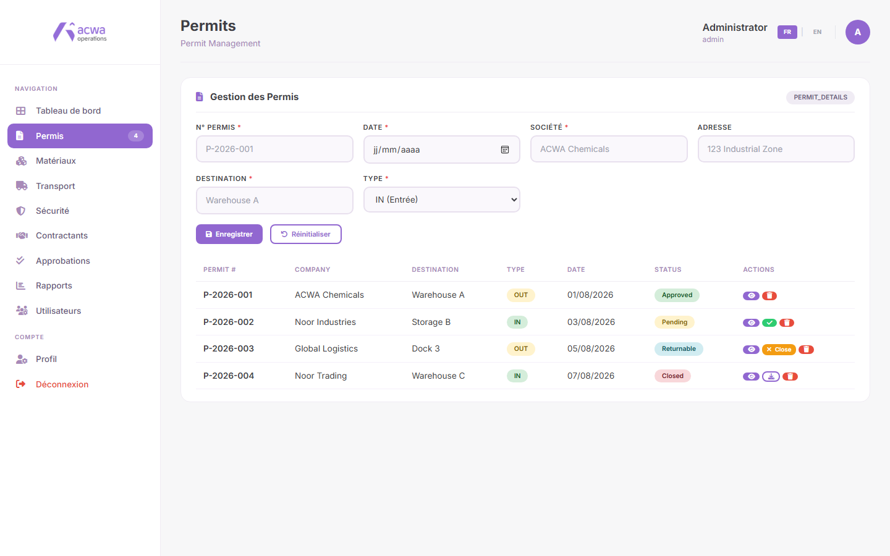
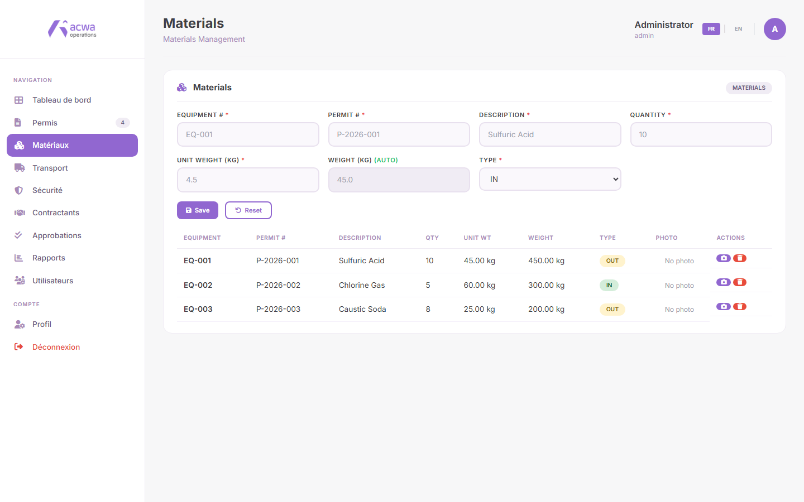

<div align="center">



# ACWA Operations

**Secure operations management platform for material flows, permits & contractor compliance.**

A full-stack web application built to digitise and control the movement of goods in
and out of an industrial site — from permit request to final approval, with a full
audit trail.

[](https://nodejs.org)
[](https://expressjs.com)
[](https://www.mysql.com)
[](#-security-architecture)
[](#-license)
[](#-security-architecture)

</div>

---

## Table of contents

- [Overview](#-overview)
- [Key features](#-key-features)
- [Tech stack](#-tech-stack)
- [Security architecture](#-security-architecture)
- [Getting started](#-getting-started)
- [API reference](#-api-reference)
- [Data model](#-data-model)
- [Project structure](#-project-structure)
- [Backup & restore](#-backup--restore)
- [Roadmap](#-roadmap)
- [License](#-license)

---

## 📌 Overview

| | |
|---|---|
| **Type** | Full-stack operations management platform (ERP-lite) |
| **Stack** | Node.js · Express · MySQL · Vanilla JS SPA |
| **Size** | ~5 400 lines · 8 tables · 38 REST endpoints |
| **Auth** | JWT (24 h) + bcrypt (cost 10) + role-based access control |
| **Interfaces** | FR / EN bilingual, dark-themed responsive dashboard |

The platform replaces paper-based gate control with a single source of truth:
every permit, every tonnage, every vehicle and every contractor signature is
recorded, timestamped and exportable.

> **Access policy** — this repository is published for review purposes. It ships
> with **no default credentials and no live demo URL**: the admin password is
> generated at first boot and never written to source. Request access if you need
> a guided tour.

---

## 📸 Screenshots

<p align="center">
  
  
</p>
<p align="center">
  
  
</p>

<!-- Add your own captures to docs/ and extend the blocks above.
     Suggested: transport, security checks, contractors, approvals,
     Excel/PDF export, user management (admin only). -->

---

## ✨ Key features

**Permits & material flow**
- Create / approve / return / close inbound & outbound permits (`IN` · `OUT` · `pending` · `approved` · `returnable` · `closed`)
- Material lines with automatic weight calculation (`quantity × unit weight`)
- Photo evidence per material entry (10 MB capped uploads)
- Equipment & vehicle tracking, security check records, contractor details
- E-signature capture for gate, security and contractor hand-overs

**Reporting**
- Excel export of the full permit register (`exceljs`)
- PDF report generation with server-side history
- Live dashboard KPIs: stock, movements, pending approvals

**User management**
- Admin / user roles, account CRUD, self-service profile
- Password change & forgotten-password flow with expiring reset tokens
- FR / EN localisation across every screen

---

## 🛠 Tech stack

| Layer | Technology |
|---|---|
| Runtime | Node.js 22+, Express 4 |
| Database | MySQL 8 (`mysql2` driver, parameterised queries) |
| Authentication | `jsonwebtoken` (HS256, 24 h) + `bcryptjs` (cost 10) |
| Rate limiting | `express-rate-limit` |
| Uploads / export | `multer` (10 MB) · `exceljs` |
| Front-end | Vanilla HTML/CSS/JS SPA — no framework, no build step |
| Tooling | `dotenv` · `nodemon` (dev) · PowerShell backup script · ngrok tunnel |

---

## 🔒 Security architecture

Security is treated as a first-class requirement, not an afterthought. Summary of
the controls implemented in this codebase:

| # | Control | Implementation |
|---|---|---|
| 1 | **No default credentials** | The `admin` account is created on first boot with a password from `ADMIN_SEED_PASSWORD` — or a 96-bit random one printed once to the console. Nothing to guess from the source. |
| 2 | **Password hashing** | `bcryptjs`, cost factor **10**. Legacy SHA-256 hashes are detected and transparently re-hashed to bcrypt on next login (one-way upgrade, never downgraded). |
| 3 | **Stateless sessions** | JWT HS256, **24 h expiry**, containing `id · email · role`. The signing secret lives only in `.env`; if it is missing the server generates an **ephemeral random secret**, so sessions are invalidated on every restart instead of falling back to a weak constant. |
| 4 | **Authentication gate on every API route** | `app.use('/api', authenticateToken)` — any endpoint not explicitly listed before that line returns **401** without a valid bearer token. |
| 5 | **Role-based access control** | `requireAdmin` middleware guards user management (`GET/POST/PUT/DELETE /api/users*`) → **403** for non-admins. |
| 6 | **Brute-force protection** | `express-rate-limit`: max **10 failed attempts / 15 min / IP** on `/api/login`, `/api/forgot-password` and `/api/reset-password`. Successful logins are not counted, so legitimate users are never locked out. Returns `429`. |
| 7 | **SQL injection** | 100 % parameterised queries (`?` placeholders) — no string concatenation into SQL anywhere. |
| 8 | **Zero secrets in git** | `.env` is git-ignored; only a documented `.env.example` placeholder is committed. Verified: no API keys, passwords, tokens or private URLs in the tree. |
| 9 | **Closed CORS** | Cross-origin access is **disabled by default** (the SPA is served from the same origin). Extra origins must be declared explicitly through `ALLOWED_ORIGINS`. |
| 10 | **Security headers** | `X-Content-Type-Options: nosniff` · `X-Frame-Options: DENY` · `Referrer-Policy: no-referrer` · `Permissions-Policy` (camera/mic/geo off) · `Cross-Origin-Opener-Policy: same-origin`. |
| 11 | **Password reset hygiene** | Token = 32 cryptographically random bytes, **1 h expiry**, single use, cleared from the DB on success. |
| 12 | **Resource limits** | JSON body capped at **100 kB**; uploads capped at **10 MB**; database backups rotated to the last 30 files. |
| 13 | **Least data exposure** | `SELECT` on login returns only the columns needed; the API never returns password hashes or reset tokens. |
| 14 | **Dependency hygiene** | Unused dependencies removed; `npm audit` run and non-breaking advisories patched. |

<details>
<summary><b>Dependency audit</b></summary>

`npm audit` reports remaining advisories that are only resolvable through
**breaking major downgrades** (`exceljs` 4 → 3, `nodemon` 3 → 1). Both are
non-production paths (spreadsheet generation and the dev watcher); they are
tracked in the roadmap rather than force-fixed.

</details>

---

## 🚀 Getting started

### Prerequisites

- **Node.js** ≥ 18
- **MySQL** 8.x
- *(optional)* [ngrok](https://ngrok.com) — only if you want a public tunnel

### 1 — Clone & install

```bash
git clone https://github.com/FatimaEzzahra79/acwa-operations.git
cd acwa-operations
npm install
```

### 2 — Configure the environment

```bash
cp .env.example .env
```

Then edit `.env`:

```ini
PORT=3000
DB_HOST=localhost
DB_USER=root
DB_PASSWORD=your_local_mysql_password
DB_NAME=noor_inventory
DB_PORT=3306

# openssl rand -hex 48
JWT_SECRET=

# Admin password for the first boot. Leave empty to auto-generate one.
ADMIN_SEED_PASSWORD=
```

> `.env` is ignored by git — your values never leave your machine.

### 3 — Create the schema

```bash
mysql -u root -p < database.sql
```

### 4 — Run

```bash
npm start          # production
npm run dev        # development (nodemon)
```

Open **http://localhost:3000/login.html**

On first boot the server prints the generated administrator credentials to the
console:

```
✅ Compte admin créé :
   email    : admin@acwa.com
   password : <printed once, never stored in source>
```

**Windows users:** `START-SITE.bat` starts the server and an optional ngrok
tunnel in one double-click.

---

## 📡 API reference

All endpoints are JSON. `🔒` = requires `Authorization: Bearer <token>`,
`🛡` = requires the `admin` role.

**Public** (called before the auth gate)

| Method | Endpoint | Purpose |
|---|---|---|
| `POST` | `/api/login` | Authenticate → returns JWT *(rate-limited)* |
| `POST` | `/api/forgot-password` | Issue reset token *(rate-limited)* |
| `POST` | `/api/verify-reset-token` | Validate a reset token |
| `POST` | `/api/reset-password` | Consume token, set new password *(rate-limited)* |

**Authenticated** 🔒

| Method | Endpoint | Purpose |
|---|---|---|
| `GET` | `/api/me` | Current session |
| `POST` | `/api/change-password` | Change own password |
| `GET` `POST` `PUT` `DELETE` | `/api/users[/:id]` | 🛡 User management |
| `GET` `POST` `PUT` `DELETE` | `/api/permits[/:permit_number]` | Permit lifecycle |
| `GET` `POST` `DELETE` | `/api/materials[/:id]` | Material lines |
| `POST` | `/api/materials/:id/photo` | Upload photo evidence |
| `GET` | `/api/export/permits-excel` | Excel export |
| `GET` `POST` `DELETE` | `/api/transports[/:id]` | Vehicle / driver records |
| `GET` `POST` `DELETE` | `/api/security[/:id]` | Security check records |
| `GET` `POST` `DELETE` | `/api/contractors[/:id]` | Contractor records |
| `GET` `POST` `DELETE` | `/api/approvals[/:id]` | Approval workflow |
| `GET` `POST` `DELETE` | `/api/pdf-history[/:id]` | Generated report history |
| `GET` | `/api/stats` | Dashboard KPIs |

---

## 🗄 Data model

```
users ──────────┐
                ├─< permit_details ──< materials
                │        │
                │        ├──< transports
                │        ├──< security_checks
                │        ├──< contractor_details
                │        └──< approvals
                └──< pdf_history
```

| Table | Purpose |
|---|---|
| `users` | Accounts, roles (`admin`/`user`), bcrypt hashes, reset tokens |
| `permit_details` | Permit header: number, date, company, direction, status |
| `materials` | Material lines linked to a permit (FK, `ON DELETE CASCADE`) |
| `transports` | Vehicles & drivers attached to a permit |
| `security_checks` | Gate security inspection records + signature |
| `contractor_details` | Contractor visits + returnable-item tracking |
| `approvals` | Multi-step approval records with signatures |
| `pdf_history` | Audit trail of generated reports |

---

## 📁 Project structure

```
acwa_operations/
├── server.js              # Express app · auth · REST API · static hosting
├── database.sql           # Schema + demo operational data (no accounts)
├── index.html             # Main SPA dashboard (permits, materials, reports…)
├── login.html             # Sign-in screen
├── reset-password.html    # Forgotten-password flow
├── admin-profile.html     # Account / profile management
├── backup.ps1             # Encrypted-location mysqldump + 30-file rotation
├── START-SITE.bat         # One-click launcher (server + optional tunnel)
├── .env.example           # Environment template — copy to .env
├── package.json
└── logo-acwa.png
```

---

## 💾 Backup & restore

```powershell
.\backup.ps1
```

Reads credentials from `.env`, dumps `noor_inventory` to `backups/` with a
timestamped name, keeps the **30 most recent** snapshots, and fails loudly if the
dump is empty. The `backups/` folder is git-ignored — dumps never reach GitHub.

Restore:

```bash
mysql -u root -p noor_inventory < backups/noor_inventory_2026-10-03_17-58.sql
```

---

## 🗺 Roadmap

- [ ] Rate-limit aware audit logging (`security_events` table)
- [ ] Refresh-token rotation & device sessions
- [ ] Helmet-managed CSP with nonces for the inline SPA scripts
- [ ] Automated tests (Jest + Supertest on the auth surface)
- [ ] Docker Compose stack (app + MySQL + Adminer)
- [ ] Force-upgrade `exceljs` / `nodemon` once compatible majors ship

---

## 📄 License

All rights reserved. © Fatima Ezzahra Hibat Allah.

Provided for portfolio and evaluation purposes: you may view and fork the code
for study, but reproduction, redistribution or commercial use requires written
permission from the author.
